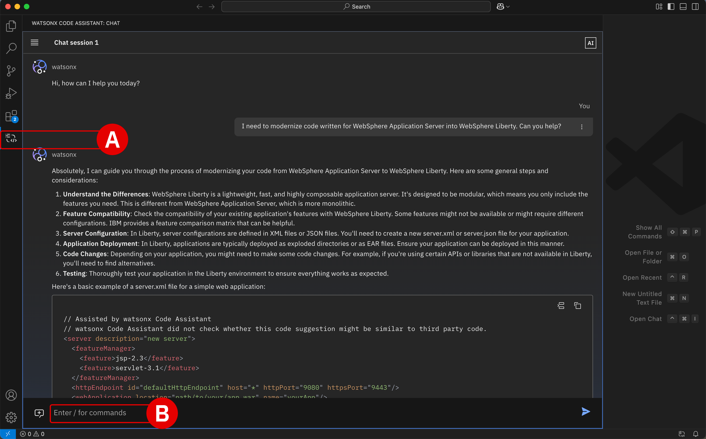

# **Security modernization**</br>*Application Modernization - WebSphere to Liberty*

!!! quote "TERMINOLOGY"
    For readability, <a href="https://www.ibm.com/products/websphere-application-server" target="_blank">**IBM WebSphere Application Server**</a> (WAS) in this chapter is referred to in shorthand as "WebSphere", unless noted otherwise. Similarly, <a href="https://www.ibm.com/products/cloud-pak-for-applications/liberty" target="_blank">**IBM WebSphere Liberty**</a> is referenced in shorthand as simply "Liberty".
    
## **i. Incentives to modernize**

Traditionally, Lariat Corporation has leveraged **WebSphere's** approach to defining application security configurations— for roles, authentication, authorization, access constraints —via external, **XML-based** deployment descriptors. Oftentimes these take the forms of standard deployment descriptors (like `web.xml`) or IBM-specific descriptors (`ibm-application-bnd.xml`).

**Liberty** applications, by contrast, utilize **Java annotations** to embed security rules directly in-line within Java classes or methods. This helps to eliminate (or at least reduce) dependencies on external XML descriptors, creating a more robust security implementation and permitting simple to maintain configurations. Java annotations are patterned using Java Enterprise Edition (Java EE or Jakarta EE) standards which align directly with the best-practices of cloud-native design.

</br>

| Feature | WebSphere XML-based security | Liberty annotations-based security |
| - | - | - |
| **Maintainability** | Complex owing to dispersed configuration. | Simplified owing to centralized and self-contained design. |
| **Readability** | Challenging due to XML files separated from Java code. | Easier due to in-line annotations that provide clarity. |
| **Productivity** | Lower developer productivity due to frequent context-switching. | Improved developer productivity due to direct configurations via code annotations. |
| **Standardization** | Considered a legacy practice, less aligned with modern industry standards. | Modern standard (Jakarta EE) that aligns with cloud-native practices. |

Ultimately, Lariat anticipates that modernization of their WebSphere application's security from XML-based descriptors to Java annotation will reduce the complexity of their security configuration management as they move steadily towards cloud-native application design.


---

## **ii. WebSphere legacy code**

First, examine the legacy code (below), which as mentioned previously is a snapshot of a larger application using **WebSphere's XML-based security**:

=== "WEBSPHERE APPLICATION SERVER"

    ``` xml linenums="1"
    <!-- web.xml -->
    <security-constraint>
        <web-resource-collection>
            <web-resource-name>SecureArea</web-resource-name>
            <url-pattern>/secured/*</url-pattern>
        </web-resource-collection>
        <auth-constraint>
            <role-name>admin</role-name>
        </auth-constraint>
    </security-constraint>

    <login-config>
        <auth-method>FORM</auth-method>
        <form-login-config>
            <form-login-page>/login.jsp</form-login-page>
            <form-error-page>/error.jsp</form-error-page>
        </form-login-config>
    </login-config>

    <security-role>
        <role-name>admin</role-name>
    </security-role>
    ```

</br>

The legacy XML-based code defines security constraints explicitly in `web.xml` using roles and URL pattern-matching, creating conditions where form-based authentication settings are specified through XML. Naturally, this complicates security management for Lariat's developer teams, as external role definitions now need to be defined owing to this architectural choice.

In order to modernize this code, Lariat will need to convert the role-based authorization mechanisms and deployment descriptors into Java annotations.

---

## **iii. Liberty modernized code**

Consider below the modernized (but functionally equivalent) application code using **Liberty's annotation-based security**:

=== "WEBSPHERE LIBERTY"

    ``` java linenums="1"
    import javax.annotation.security.DeclareRoles;
    import javax.annotation.security.RolesAllowed;
    import javax.ws.rs.GET;
    import javax.ws.rs.Path;
    import javax.ws.rs.core.Response;

    @Path("/secured")
    @DeclareRoles({"admin"})
    public class SecuredEndpoint {

        @GET
        @Path("/data")
        @RolesAllowed("admin")
        public Response getSecuredData() {
            return Response.ok("Sensitive data available only to admins.").build();
        }
    }
    ```

=== "WEBSPHERE APPLICATION SERVER"

    ``` xml linenums="1"
    <!-- web.xml -->
    <security-constraint>
        <web-resource-collection>
            <web-resource-name>SecureArea</web-resource-name>
            <url-pattern>/secured/*</url-pattern>
        </web-resource-collection>
        <auth-constraint>
            <role-name>admin</role-name>
        </auth-constraint>
    </security-constraint>

    <login-config>
        <auth-method>FORM</auth-method>
        <form-login-config>
            <form-login-page>/login.jsp</form-login-page>
            <form-error-page>/error.jsp</form-error-page>
        </form-login-config>
    </login-config>

    <security-role>
        <role-name>admin</role-name>
    </security-role>
    ```

</br>

The modernized, Java annotations-driven security of Liberty defines `@DeclareRoles` (**line 8**) and `@RolesAllowed` (**line 13**) to clearly create security constraints at the method and class level.

``` java hl_lines="1 5"
@DeclareRoles({"admin"})
@Path("/secured")
public class SecuredEndpoint {
    @GET
    @RolesAllowed("admin")
    public Response getSecuredData() {
        return Response.ok("Sensitive data available only to admins.").build();
    }
}
```

</br> 

This approach simplifies the URL and method-level security mechanisms that were present within the legacy WebSphere code, replacing it via annotations within RESTful (REST API-addressable) endpoints.

Ultimately, this reduces the need for external configuration and instead centralizes security declarations closer to the actual code implementation. Lariat, in turn, gains the benefits of improved clarity in how their security constraints are structured. This will enable more straightforward audits in the future and simplify the ongoing maintenance of security policies across their organization.

---

## **iv. Hands-on with WCA**

In the following section, participants will have the opportunity to experiment with the **watsonx Code Assistant** (**WCA**) service set up in the <a href="https://ibm.github.io/wca-l4/saas/1/" target="_blank">**IBM Cloud (SaaS) Configuration module**</a>.

- Using the **Chat** feature, which can be accessed via the WCA extension for Visual Studio Code (VS Code), you will first ask WCA convert the original *WebSphere Application Service (WCA)* code into a modernized equivalent for *WebSphere Liberty*.
- The lab guide documentation will then walk you through an analysis of the WCA-generated Liberty code and compare that to the best-practice Liberty code discussed previously in **iii. Liberty modernized code**.
- After comparing the two approaches to Liberty modernization, you will have the opportunity to continue tinkering with the WCA Chat service. Experimentation is encouraged. Try influencing WCA's generative AI recommendations by making further prompts or inquiries into the code responses it generates.

When satisfied, you may proceed onwards to the next module.

---

1. **Log in** to the <a href="https://ibm.github.io/wca-l4/saas/3/#iii-install-the-extension" target="_blank">**WCA extension with VS Code**</a>. Once authenticated, proceed to Step 2.

---

2. From the left taskbar, ensure that **watsonx Code Assistant**^[A]^ extension is selected.

    Within the **Chat Session** window, **click** on the `Enter / for commands` prompt^[B]^ as shown.

    </br>
    

---

3. Prime the service to be ready to intake legacy WAS code and modernize that into Liberty code. As a suggestion, **copy** the following prompt, **paste** it into the chat window, and hit ++return++ to execute the modernization request:

    ```
    I need to modernize code written for WebSphere Application Server into WebSphere Liberty. Can you help?
    ```
    !!! warning ""
        **TIP:** You can increase the width of the Chat Session window by clicking and dragging the right-side of the window frame and pulling it towards the right of the screen.

---

4. Now that WCA is primed to receive WAS code, **copy and paste** the following code block into the **Chat Session**, then ++return++ to execute.

    === "WEBSPHERE APPLICATION SERVER"

        ``` xml linenums="1"
        <!-- web.xml -->
        <security-constraint>
            <web-resource-collection>
                <web-resource-name>SecureArea</web-resource-name>
                <url-pattern>/secured/*</url-pattern>
            </web-resource-collection>
            <auth-constraint>
                <role-name>admin</role-name>
            </auth-constraint>
        </security-constraint>

        <login-config>
            <auth-method>FORM</auth-method>
            <form-login-config>
                <form-login-page>/login.jsp</form-login-page>
                <form-error-page>/error.jsp</form-error-page>
            </form-login-config>
        </login-config>

        <security-role>
            <role-name>admin</role-name>
        </security-role>
        ```

---

5. After a few moments, WCA will return a combination of code blocks and explanations to the Chat session console. Cycle through the tab(s) below to examine the **modernized, WCA-generated Liberty code**.

    === "LIBERTY `web.xml` Part 1"

        ``` xml linenums="1"
        <security-constraint>
            <web-resource-collection>
                <web-resource-name>SecureArea</web-resource-name>
                <url-pattern>/secured/*</url-pattern>
            </web-resource-collection>
            <auth-constraint>
                <role-name>admin</role-name>
            </auth-constraint>
        </security-constraint>
        <security-role>
            <role-name>admin</role-name>
        </security-role>
        <security-role-mapping>
            <role-name>admin</role-name>
            <user>adminUser</user>
        </security-role-mapping>
        ```

    === "LIBERTY `web.xml` Part 2"

        ``` xml linenums="1"
        <security-constraint>
            <web-resource-collection>
                <web-resource-name>SecureArea</web-resource-name>
                <url-pattern>/secured/*</url-pattern>
                <http-method>POST</http-method>
            </web-resource-collection>
            <auth-constraint>
                <role-name>admin</role-name>
            </auth-constraint>
        </security-constraint>
        ```

    === "LIBERTY `web.xml` Part 3"

        ``` xml linenums="1"
        <login-config>
            <auth-method>BASIC</auth-method>
            <realm-name>MyRealm</realm-name>
        </login-config>
        ```

    === "LIBERTY `web.xml` Part 4"

        ``` xml linenums="1"
        <error-page>
            <error-code>401</error-code>
            <location>/unauthorized.jsp</location>
        </error-page>
        ```

---

## **v. Next steps**

Having concluded the **Application Modernization - WebSphere to Liberty** hands-on modules, participants should now complete the corresponding *Evaluation* quiz and then continue with the remainder of the L4 curriculum.