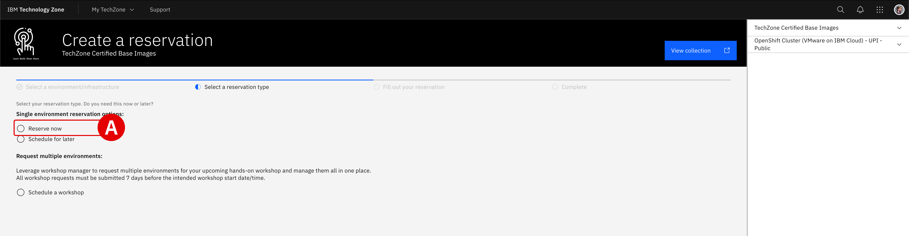
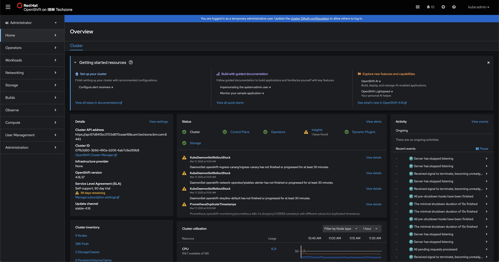

# **Reserve an Environment** *On-Premises Installation and Deployment*

!!! quote ""
    If you require assistance or run into issues with the hands-on lab, help is available.

    - **Environment issues:** The lab environment is managed by IBM Technology Zone. <a href="https://techzone.ibm.com/help" target="_blank">**Opening a support case ticket**</a> is recommended for issues related to the hands-on environment (provisioning, running, and so on.)

    - **Documentation issues:** If there is an error in the lab documentation, or if you require additional support in completing the material, open a thread on the <a href="https://ibm.enterprise.slack.com/archives/C063VF1G54J" target="_blank">**#wca-ansible-techzone-support**</a> Slack channel.

## **i. Configuring the IBM Technology Zone reservation**

The foundation for the on-premises environment utilizes the `OpenShift Cluster (VMware on IBM Cloud) - UPI - Public` template from the collection of <a href="https://techzone.ibm.com/collection/tech-zone-certified-base-images/journey-vmware-on-ibm-cloud-environments" target="_blank">**IBM Technolgy Zone (ITZ) Certified Base Images**</a>.

---

1. **Click** the link below to request a reservation directly from ITZ:

    !!! warning ""
        **URL:** <a href="https://techzone.ibm.com/my/reservations/create/63a3a25a3a4689001740dbb3" target="_blank">**https://techzone.ibm.com/my/reservations/create/63a3a25a3a4689001740dbb3**</a>

---

2. From the *Single environment reservation options*, select **Reserve now**^[A]^.

     
    {: loading=lazy width="400"}

---

3. Supply additional details about the ITZ reservation request:

    !!! note "RESERVATON POLICY NOTICE"
        After selecting `Education` for the *Purpose* field, you may receive a pop-up notification stating that `this environment is now being redirected to the OCP base image hosted On-Prem for Education and Test`. You can safely **ignore** this notice and close it by clicking the *X* in the top-right corner.
        
        **Do not** configure using the Poughkeepsie-based resource that the notice attempts to redirect you to — it will not allow you to configure the necessary hardware specifications. Continue with the ITZ reservation request form as detailed below. If the pop-up appears again later in the configuration steps, continue to disregard the notice.

    | Field                                                | Value                                                                                                                         |
    | ---------------------------------------------------- | ----------------------------------------------------------------------------------------------------------------------------- |
    | **Name**                                             | Give your reservation a unique name.                                                                                          |
    | **Purpose**                                          | `Education`                                                                                                                   |
    | **Purpose Description**                              | Give your reservation a unique description.                                                                                   |
    | **Preferred Geography**                              | Select the region and data center geographically closest to your location.                                                    |
    | **End Date and Time**                                | Select a time and date for when the reservation will expire.                                                                  |
    | **OpenShift Version**                                | `4.16`                                                                                                                        |
    | **Worker Node Count**                                | `3`                                                                                                                           |
    | **Worker Node Flavor**                               | `32 vCPU x 128 GB - 300 GB ephemeral storage`                                                                                 |
    | **Storage**                                          | `ODF - 2 TB`                                                                                                                  |
    | **OCP/Kubernetes Cluster Network**                   | `10.128.0.0/14`                                                                                                               |
    | **OCP/Kubernetes Service Network**                   | `172.30.0.0/16`                                                                                                               |
    | **Enable nested hardware virtualization on workers** | `No`                                                                                                                          |

4. When satisfied, verify that you agree to the *Terms and Conditions* for the environment and finalize your reservation request by clicking **Submit**.

    Navigate to the **<a href="https://techzone.ibm.com/my/reservations" target="_blank">My Reservations</a>** tab of the ITZ to monitor the progress of your reservation. Wait for the ITZ reservation to be marked as *"Ready"* before continuing.

    !!! warning "PROVISIONING TIMES"
        This operation will take approximately **90 - 120 minutes** to complete.
        
    {: loading=lazy width="400"}
     
    {: loading=lazy width="400"}

## **ii. Accessing the cluster**

Once the cluster has been successfully deployed, you will receive an email with the header: `Reservation Ready on IBM Technology Zone`. 

---

5. Confirm that the ITZ email states that **Status Update: Ready**^[A]^. Follow the link provided in the email, or access the **<a href="https://techzone.ibm.com/my/reservations" target="_blank">My Reservations</a>** tab on ITZ to access your reservation.

     
    {: loading=lazy width="400"}

---

6. Scroll down the page until you reach the **Reservation Details** section. Record the following connection details for the OpenShift Container Platform (OCP) cluster to a notepad:

    - *Desktop URL* (interchangeable with **OCP Dashboard URL**)
    - *Cluster Admin Username*
    - *Cluster Admin Password*
    - *API URL*
    - *Bastion Username*
    - *Bastion Password*
    - *Bastion SSH Connection*

     
    {: loading=lazy width="400"}
     
    {: loading=lazy width="400"}

---

7. Click the blue **Open your IBM Cloud environment** button at the top of the page to launch a new browser window for accessing the OCP cluster.

    Choose the **kube:admin** log in option and then provide the following credentials:

    - *Username:* `kubeadmin`
    - *Password:* *Cluster Admin Password* recorded in Step 6

    At this stage, you should have successfully logged in to the OCP Dashboard.

    {: loading=lazy width="400"}
---

## **iii. Next steps**

In the following module, you will access and configure the cluster's bastion node.