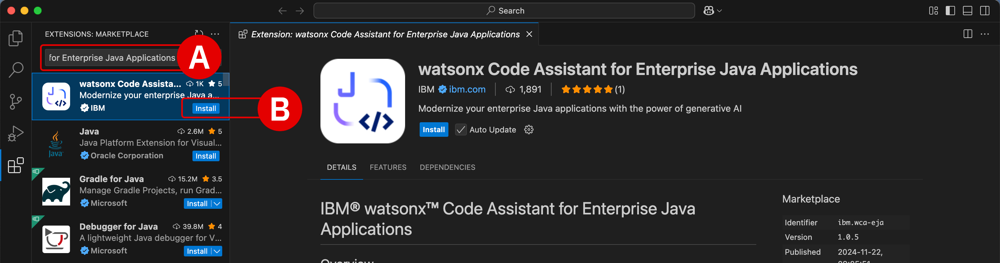
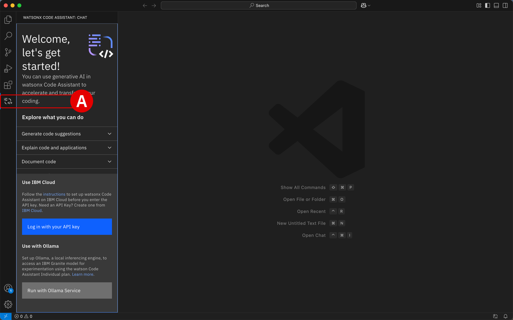

# **Install WCA extension for Visual Studio Code**</br>*IBM Cloud (SaaS) Configuration*


## **i. Objectives and rationale**

With the WCA service component of the SaaS architecture now successfully provisioned via the ITZ, participants will now need to set up the WCA extension within an integrated development environment (IDE). WCA currently supports both *Visual Studio Code* (**VS Code**) and *Eclipse IDE*.

This module guides participants through the process of installing VS Code on their local machine. Afterwards, the WCA extension ("plug-in") can then be easily integrated with the IDE and authorized for use with the ITZ-provisioned WCA service.

!!! note "WHY INSTALL LOCALLY?"
    Be aware that ITZ only allows two environments to be reserved for education and training purposes at any one time. Reservations for client demonstrations and pilots do not count against this limit.
    
    The WCA Standard plan on SaaS requires at least one reservation slot. The on-premises environment already provisioned through ITZ for the previous <a href="https://ibm.github.io/wca-l4/on-premises/1/" target="_blank">**On-Premises Installation and Deployment**</a> modules is occupying the second available slot. Provisioning an ITZ-hosted virtual machine (VM) environment will require a third slot — exceeding what ITZ supports. Therefore, to accommodate a virtualized desktop, participants would **need to retire and deprovision** the on-premises environment that they've already gone to great lengths to set up. Let's avoid that scenario, if possible.

    IBM watsonx Code Assistant works great on locally-installed IDEs via extensions built into VS Code and Eclipse IDE. In fact, it's the *de facto* way to interact with the service and provides the best impression for users by far — with a less cumbersome experience with the lab guide instructions and much more responsive IDE interactions.

## **ii. Locally install VS Code**

Before you configure the extension for VS Code, you must first install the IDE on your machine.

---

1. Download the latest **Stable Build**^[A]^ release of VS Code available for your machine's operating system using the link below.

    </br>
    

    !!! warning ""
        **Download**: <a href="https://code.visualstudio.com" target="_blank">https://code.visualstudio.com</a>

        Follow along with the installer wizard steps and continue with the hands-on lab instructions once VS Code is running on your local machine.

---

2. Launch the VS Code application and take note of the sidebar along the left-side.

    Click the **Extensions**^[A]^ icon to open the marketplace of services and open source technologies that can be integrated with VS Code.

    </br>
    

---

## **iii. Install the extension**

Search for the <a href="https://marketplace.visualstudio.com/items?itemName=IBM.wca-eja" target="_blank">**watsonx Code Assistant for Enterprise Java Applications**</a> extension, which corresponds to the WCA Standard plan. This plug-in supports all the features of the Essentials plan, plus enterprise Java modernization capabilities, enhanced code explanation, and enhanced unit test generation — all of which will be necessary for the Level 4 curriculum and hands-on training.

---

3. Into the **search bar**^[A]^ under the *Extensions* tab, enter the following text:

    ``` shell
    watsonx Code Assistant for Enterprise Java Applications
    ```

    - After locating the extension, click the **Install**^[B]^ button
    - When prompted, select **Trust Publisher & Install**^[C]^ to confirm the procedure

    </br>
    
    </br>
    

    !!! note "OTHER EXTENSIONS ARE AVAILABLE"
        Note that Standard plan installation creates **two** entries in your Visual Studio Code Extensions panel: one for *watsonx Code Assistant* and one for *watsonx Code Assistant for Enterprise Java Applications*. The two extensions are dependencies for this installation.
        
        Two other plug-ins are available within VS Code for *IBM watsonx Code Assistant* specifically, and even more for other offerings such as *IBM watsonx Code Assistant for Red Hat Ansible Lightspeed* and *IBM watsonx Code Assistant for Z*. For WCA, there are alternative extensions available for <a href="https://marketplace.visualstudio.com/items?itemName=IBM.wca-core" target="_blank">**Trial Plan**</a> and <a href="https://marketplace.visualstudio.com/items?itemName=IBM.wca-core" target="_blank">**Essential Plan**</a> tiers.

---

4. To open WCA within VS Code, click on the **watsonx Code Assistant**^[A]^ icon that has appeared along the left-hand side of the VS Code IDE. You will be greeted with a `Welcome, let's get started!` prompt within the IDE.

    </br>
    

---

5. Now let's authorize the extension for use with the WCA service provisioned on IBM Cloud. From the WCA panel, click **Log in with your API key**^[A]^ to continue.

    </br>
    

---

6. A drop-down menu will open at the top of the VS Code interface. **Copy and paste**^[A]^ the *WCA API Key* that was recorded in <a href="https://ibm.github.io/wca-l4/saas/2/#iv-create-a-service-id-and-api-key" target="_blank">**Step 24 of Module 2**</a> into the prompt.

    - The interface should display a line of text indicating a *Valid API Key* has been detected
    - Press ++return++ to confirm the input
    - When prompted with *The extension 'watsonx Code Assistant' wants to sign in using WCA API Key*, click **Allow**^[B]^

    </br>
    
    </br>
    

---

7. Confirm that the extension successfully authenticated with the WCA service by looking for an open *Chat session 1* with `watsonx` along the left side of the WCA extension page^[A]^. If this Chat interface is available and operational, that confirms that VS Code extension has been successfully integrated with the WCA service.

    </br>
    

---

## **iv. Set up the enterprise Java application environment**

As you will be working with the WCA Standard Plan and interacting with enterprise Java applications, you will need to perform some additional configuration (beyond what would be needed for the Trial or Essentials plans).

---

8. Locally you must **install** *either* Java or Apache Maven distributions. Details and download links for the two are summarized in the table below.

    **Java Requirements**

    | Distribution | Details | Resources |
    | - | - | - |
    | **Java** | Java SE 11 with Java Developer Kit 11, or a later version. | **<a href="https://www.java.com/en/download/manual.jsp" target="_blank">Download</a>** |
    | **Maven** | Use Maven to build your application. If you are using Liberty Tools and the Liberty Maven plug-in to build your app or project, use at least Maven 3.8.6. | **<a href="https://maven.apache.org/download.cgi" target="_blank">Download</a>** |

---

9. With your preferred Java distribution installed locally, you now need to set the appropriate environment variables.

    Find the Java installation path on your local machine using the instruction set that corresponds to your local operating system.

    - **macOS:** Open a Terminal and execute: `/usr/libexec/java_home`
        - The output should resemble something like: `/Library/Java/JavaVirtualMachines/jdk-17.jdk/Contents/Home`
    - **Windows:** Open a Command Prompt and execute: `echo %JAVA_HOME%`
        - If the `JAVA_HOME` variable has not yet been set, the Java installations are typically located in the `C:\Program Files\Java\jdk-XX.X.X` directory

---

10. Set the `JAVA_HOME` environment variable.

    - **macOS:** Edit the shell configuration file
        - Default shell (`zsh`) with Terminal: `nano ~/.zshrc`
        - Alternatively, older shell (`bash`) with Terminal: `nano ~/.bash_profile`
        - **Add** the following line to the file:
        ``` shell
        bash<br>export JAVA_HOME=$(/usr/libexec/java_home)<br>
        ```
        - **Save** (++ctrl++ + ++o++) and **exit** (++ctrl++ + ++x++) the editor
    - **Windows:**
        - Open the **Start** menu and search for `Environment Variables`
        - Select *Edit the system environment variables* option
        - Click the **Environment Variables** button
        - Under *System Variables*, click **New**
        - Set the *Variable Name* = `JAVA_HOME` and *Variable Value* = *JDK path from Step 9* (e.g. `C:\Program Files\Java\jdk-17`)
        - Click **OK** to finalize

---

11. Apply the changes immediately.
    - **macOS**: Run *either* of these commands with Terminal
        - For `zsh` shell: `source ~/.zshrc`
        - For `bash` shell: `source ~/.bash_profile`
    - **Windows:**
        - Close all open command prompts or terminals
        - Open a *new* Command Prompt to pick up the changes

---

12. Verify the `JAVA_HOME` environment variable has been correctly set.
    - **macOS:**
        - With Terminal, execute: `bash<br>echo $JAVA_HOME<br>`
        - The console will return the Java installation path
    - **Windows:**
        - With Command Prompt, execute: `cmd<br>echo %JAVA_HOME%<br>`
        - The console will return the Java installation path

---

13. For both **macOS** and **Windows** users, you must **restart** the Visual Studio Code application for the changes to take effect within the IDE. **Close and re-launch the application.**

    </br>
    At this stage, the WCA Standard Plan extension for VS Code has been successfully installed and configured! Additional context and information is presented below (<a href="https://ibm.github.io/wca-l4/saas/3/#iv-set-up-enterprise-java-environment" target="_blank">**vi. Determine the JDK**</a> and <a href="https://ibm.github.io/wca-l4/saas/3/#vi-set-the-logging-level" target="_blank">**vii. Set the logging level**</a>) for those curious to learn more. Otherwise, continue on to Section <a href="https://ibm.github.io/wca-l4/saas/3/#vi-next-steps" target="_blank">**viii. Next steps**</a> to conclude the module.

---

## **v. Determine the JDK**

For VS Code and WCA Standard Plans, watsonx Code Assistant needs to determine the Java developer kit (JDK) to use, in the following order of precedence:

| Order of precedence | Description |
| - | - |
| **1** | Globally-configured Java developer kit for automatic building in the Red Hat extension, which is `java.configuration.runtimes` in the IDE `settings.json` file |
| **2** | `java.jdt.ls.java.home` or `java.home` IDE settings if they are present |
| **3** | `JAVA_HOME` system environment variable, or else `JDK_HOME` |
| **4** | The Java developer kit in the system `PATH` |

When WCA Standard Plan features are used, such as Java modernization or upgrade, you can verify which Java developer kit is being used:
    
- Within the VS Code IDE, click **View** and then **Output**
- In the *Output* view, use the dropdown menu to select **WCA**
- Look for a message such as `Using the Java developer kit that is defined in <location> to run watsonx Code Assistant components. The path is: <path>` to determine the feature currently in use

---

## **vi. Set the logging level**

To adjust logging for the VS Code extension for WCA:

- From the **Extensions** panel of VS Code, locate the WCA extension and right-click to pull down a list of available options
- Select the **Extension Settings** option
- Scroll down (or search) for **WCA: Log level**
- You may adjust this field from the default `INFO` setting to alternative options (like `WARN`) to cycle between various logging levels

---

## **vii. Next steps**

The following module will guide participants through the steps of locally configuring Eclipse IDE for use with the WCA extension.